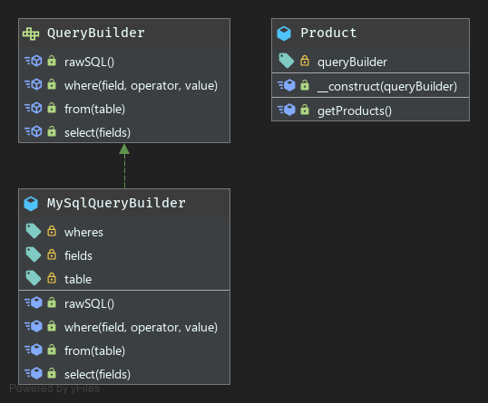

# Builder Pattern

**Definition**
```
The Builder design pattern separates the construction of a complex object from its representation.
```

***Why use builder pattern?***
- To avoid constructor with many optional arguments.
- No need to know the exact order of build steps.
- Leverage fluent interfaces.
- Ideal for high level of encapsulation & consistency.
- Different builder implementations can be offered.

***Drawback***
- Duplicated code in builder and built object classes.
- Sometimes very verbose.

### UML

